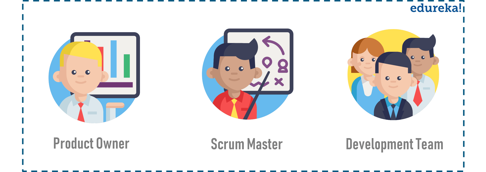

# tech201_agile_and_scrum
Agile and scrum presentaion.
# What is agile ?

Agile is an approach to project management and software development that helps teams deliver value to their customers faster and with fewer defects.

### Methodology 
It is a way to manage a project by breaking it up into several phases. It is a constant collaboration with stakeholders and continuous improvement.

### Techniques

- Daily stand-up
- Sprint planning meetings
- Team review
- The backlog
- Teams walls
- Trello

## Origin of Agile
- Software developers in the 80s experienced high levels of failed projects
- Software developers collaborated and experimented with new ways of working
- They took ideas and wrote down a set of underlying values and principles

# Scrum
It is a team-based framework to develop complex systems and products.

## Framework

Team members can address problems while creatively delivering products.

.png)

### Benefits of Scrum
- Quicker release of usable products
- Higher productivity
- Lower costs
- Completing complex projects in the most efficient way

# Three pillars of Scrum

###  1.Transparency
Everyone presents the facts as is and collaborates for the common objective.

### 1.Inspection
Not done by the inspector but by everyone on the Scrum team.
Inspection can be done for product, processes, people aspects and practices.

### 3.Adaptation
This is about continuous improvement to adapt based on the results of the inspection, everyone should reflect on how to improve.

# Scrum roles

### Product owner
Key stakeholder who should have a deep understanding of the product and communicates with both team and other stakeholders.

### Scrum Master 
Ensures that the team keeps to the value of Scrum, facilitates meetings and removes impediments.

### Development team
- Effectively 3-9 people
- Decides how the work will be done 
- Everyone is accountable 

# Benefits of Scrum